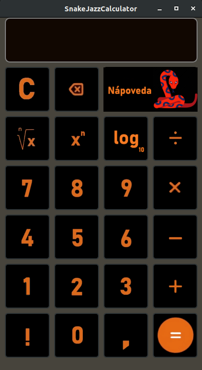

# SnakeJazzCalculator

Kalkulačka týmu Python vytvorená vrámci 2. projektu v predmete IVS na FIT VUT Brno

    

Prostredie
---------

Ubuntu 64bit

Autori
------

Python
- xponek00 Timotej Ponek 
- xprecn00 Marek Precner 
- xkralo05 Kristián Královič 
- xvalko11 Marek Valko 

Licencia
-------

Tento program je poskytovaný pod liceniou GNU GPL v3.0
