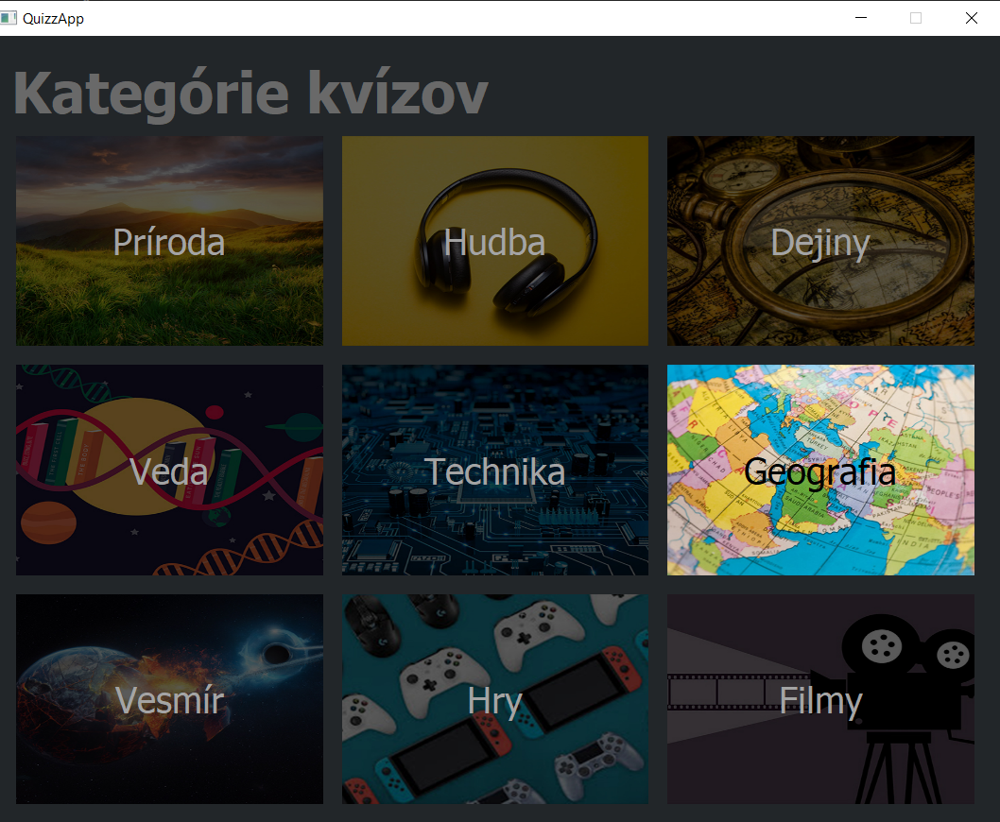
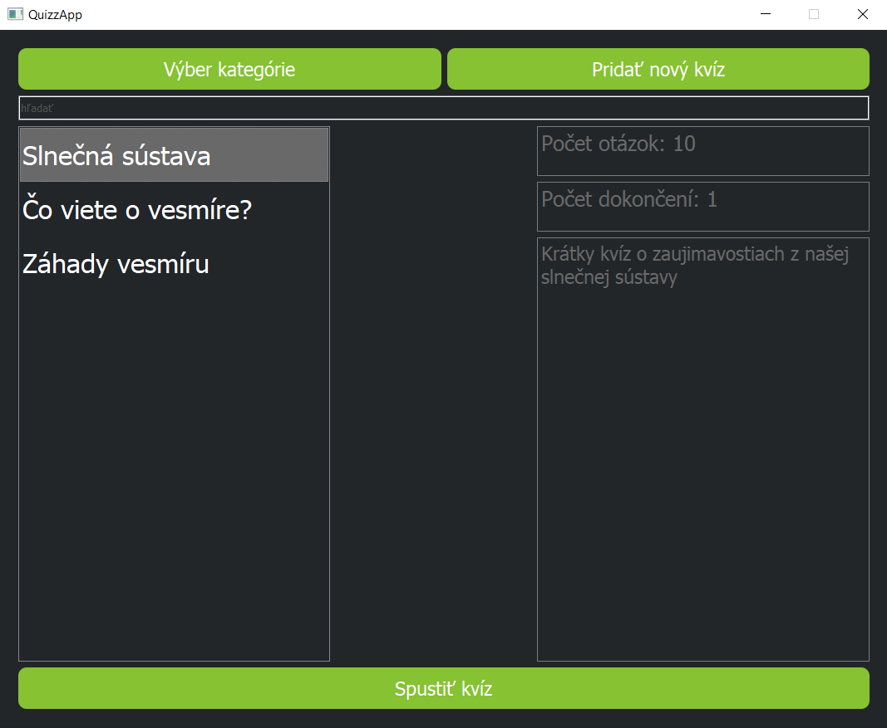
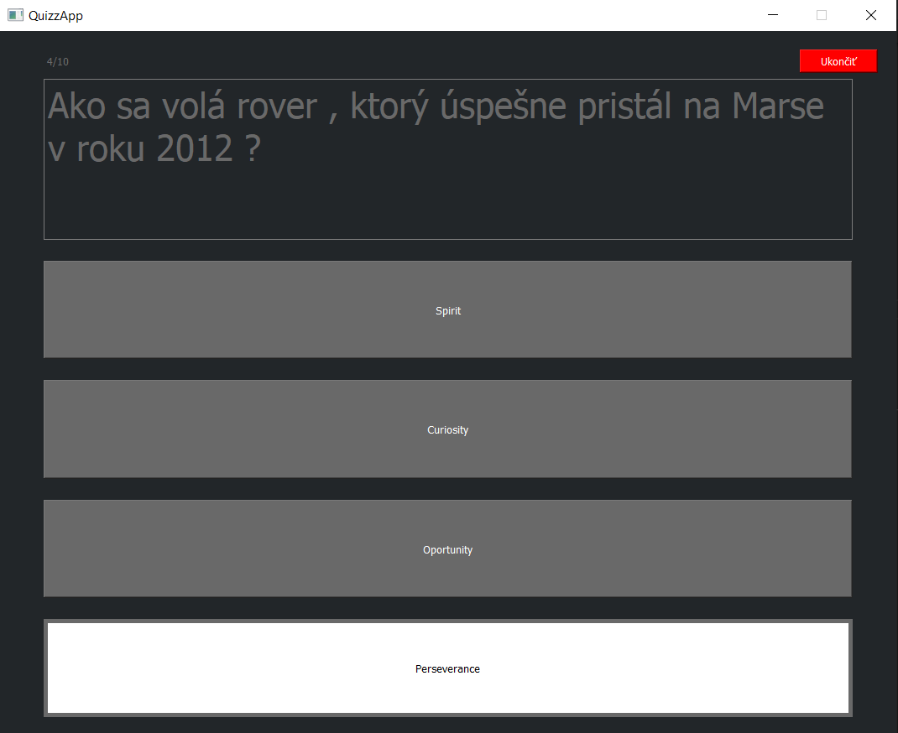
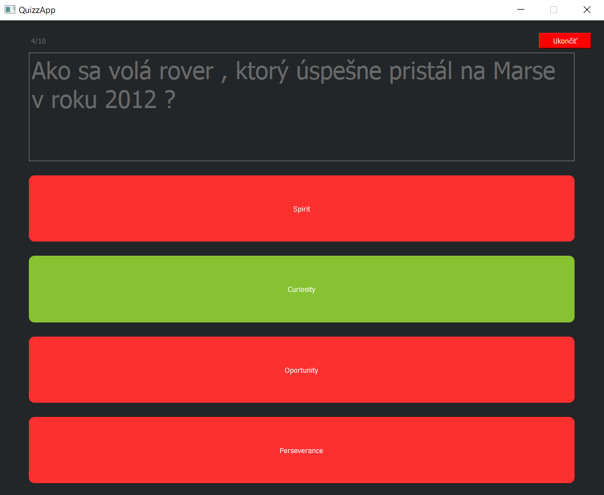
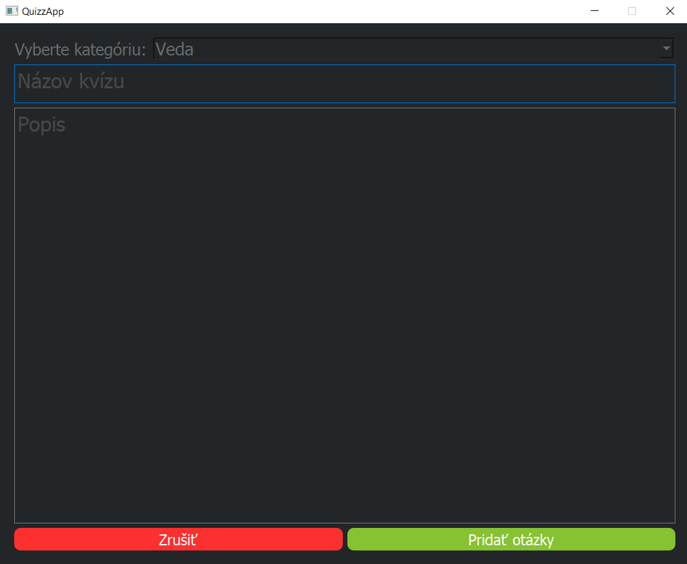
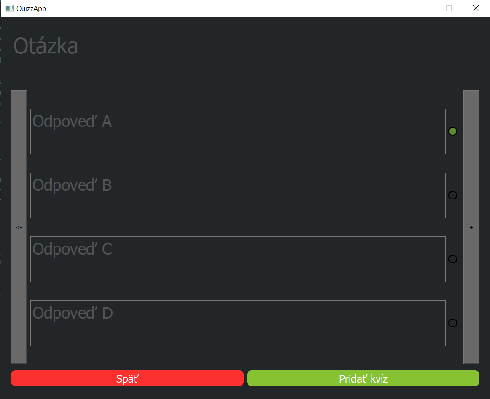

# QuizApp

Aplikácia na otestovanie znalostí v jednoduchých kvízoch vytvorená vrámci projektu v predmete ITU na FIT VUT Brno

Prostredie
---------

Ubuntu 64bit
Windows 10 64bit

Autor
------
- Marek Valko 

Licencia
-------

Tento program je poskytovaný pod liceniou GNU GPL v3.0

Ukážka aplikácie
-------

    

    

    

    

    

    

